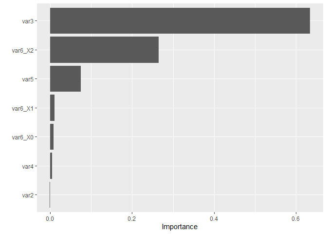

<!-- README.md is generated from README.Rmd. Please edit that file -->

# easytidymodels

<!-- badges: start -->

<!-- badges: end -->

The goal of easytidymodels is to make running analyses in R using the
tidymodels framework even easier. This is custom code I wrote to make
the code more reproducible and avoid copy-pasting so often. Note: this
is currently a work in progress\!

## Installation

You can install easytidymodels like this:

``` r
# install.packages("devtools")
devtools::install_github("amanda-park/easytidymodels")
```

## Preparing Data for Analysis

This is a basic example of one splitting data in the package.

  - The function trainTestSplit is a wrapper for rsample’s function that
    allow you to nicely split up your data into training and testing
    sets. For reusability’s sake it has been put into a function here.
  - The function cvFolds is a wrapper for rsample’s vfold\_cv.
  - The function createRecipe just creates a simple recipe of your
    dataset. If more advanced recipes are required, I recommend calling
    recipe() and creating one specific to your dataset’s needs.

<!-- end list -->

``` r
library(easytidymodels)

#Simulate data
df <- data.frame(var1 = as.factor(c(rep(1, 50), rep(0, 50))),
                 var2 = rnorm(100),
                 var3 = c(rnorm(55), rnorm(45, 5)),
                 var4 = rnorm(100),
                 var5 = c(rnorm(60), rnorm(40, 3)),
                 var6 = as.factor(c(rep(0, 20), rep(1, 40), rep(2, 40))))

#Set response variable
resp <- "var1"


split <- trainTestSplit(data = df, 
                        responseVar = resp)

#Create simple recipe object
rec <- createRecipe(split$train, 
                    responseVar = resp)

#Create training, testing, and bootstrapped data sets
train_df <- recipes::bake(rec, split$train)
test_df <- recipes::bake(rec, split$test)
boot_df <- split$boot

#Create cross-validation folds
folds <- cvFolds(train_df, 5)
```

## Classification Examples

### Logistic Regression

Tunes both the penalty and mixture terms, fits a model based on the
classification evaluation metric specified (default bal\_accuracy), and
returns an evaluation of the model on both the training and testing
data.

``` r
# #Run logistic regression - only commented to avoid readme error
# lr <- logRegBinary(recipe = rec,
#                    response = resp,
#                    folds = folds,
#                    train = train_df,
#                    test = test_df)

# #Shows training and testing data confusion matrix
# lr$trainConfMat
# lr$testConfMat
# 
# #Shows training data confusion matrix plot
# lr$trainConfMatPlot
# lr$testConfMatPlot
# 
# #Shows training data score based on classification metrics
# lr$trainScore
# lr$testScore
# 
# #Shows actual predictions for training and testing
# lr$trainPred
# lr$testPred
# 
# #Shows tuned model optimized on evaluation metric chosen
# lr$final
```

### XGBoost

Tunes the following:

  - learn\_rate (or eta)

  - sample\_size (or subsample)

  - mtry (or colsample\_bytree)

  - min\_n (or min\_child\_weight)

  - tree\_depth (or max\_dept)

Fits a model based on the classification evaluation metric specified
(default bal\_accuracy), returns an evaluation of the model on both the
training and testing data, and also returns variable importance for the
model.

``` r
#XGBoost classification
xgClass <- xgBinaryClassif(
                   recipe = rec,
                   response = resp,
                   folds = folds,
                   train = train_df,
                   test = test_df,
                   evalMetric = "roc_auc"
                   )
#> Loading required package: dplyr
#> 
#> Attaching package: 'dplyr'
#> The following objects are masked from 'package:stats':
#> 
#>     filter, lag
#> The following objects are masked from 'package:base':
#> 
#>     intersect, setdiff, setequal, union
#> 
#> Attaching package: 'recipes'
#> The following object is masked from 'package:stats':
#> 
#>     step
#> For binary classification, the first factor level is assumed to be the event.
#> Use the argument `event_level = "second"` to alter this as needed.
#> Loading required package: scales
#> 
#> Attaching package: 'scales'
#> The following object is masked from 'package:purrr':
#> 
#>     discard
#> 
#> Attaching package: 'rlang'
#> The following objects are masked from 'package:purrr':
#> 
#>     %@%, as_function, flatten, flatten_chr, flatten_dbl, flatten_int,
#>     flatten_lgl, flatten_raw, invoke, list_along, modify, prepend,
#>     splice
#> 
#> Attaching package: 'vctrs'
#> The following object is masked from 'package:tibble':
#> 
#>     data_frame
#> The following object is masked from 'package:dplyr':
#> 
#>     data_frame
#> 
#> Attaching package: 'xgboost'
#> The following object is masked from 'package:dplyr':
#> 
#>     slice
#> i Fold1: preprocessor 1/1
#> v Fold1: preprocessor 1/1
#> i Fold1: preprocessor 1/1, model 1/10
#> v Fold1: preprocessor 1/1, model 1/10
#> i Fold1: preprocessor 1/1, model 1/10 (predictions)
#> i Fold1: preprocessor 1/1, model 2/10
#> v Fold1: preprocessor 1/1, model 2/10
#> i Fold1: preprocessor 1/1, model 2/10 (predictions)
#> i Fold1: preprocessor 1/1, model 3/10
#> v Fold1: preprocessor 1/1, model 3/10
#> i Fold1: preprocessor 1/1, model 3/10 (predictions)
#> i Fold1: preprocessor 1/1, model 4/10
#> v Fold1: preprocessor 1/1, model 4/10
#> i Fold1: preprocessor 1/1, model 4/10 (predictions)
#> i Fold1: preprocessor 1/1, model 5/10
#> v Fold1: preprocessor 1/1, model 5/10
#> i Fold1: preprocessor 1/1, model 5/10 (predictions)
#> i Fold1: preprocessor 1/1, model 6/10
#> v Fold1: preprocessor 1/1, model 6/10
#> i Fold1: preprocessor 1/1, model 6/10 (predictions)
#> i Fold1: preprocessor 1/1, model 7/10
#> v Fold1: preprocessor 1/1, model 7/10
#> i Fold1: preprocessor 1/1, model 7/10 (predictions)
#> i Fold1: preprocessor 1/1, model 8/10
#> v Fold1: preprocessor 1/1, model 8/10
#> i Fold1: preprocessor 1/1, model 8/10 (predictions)
#> i Fold1: preprocessor 1/1, model 9/10
#> v Fold1: preprocessor 1/1, model 9/10
#> i Fold1: preprocessor 1/1, model 9/10 (predictions)
#> i Fold1: preprocessor 1/1, model 10/10
#> v Fold1: preprocessor 1/1, model 10/10
#> i Fold1: preprocessor 1/1, model 10/10 (predictions)
#> i Fold2: preprocessor 1/1
#> v Fold2: preprocessor 1/1
#> i Fold2: preprocessor 1/1, model 1/10
#> v Fold2: preprocessor 1/1, model 1/10
#> i Fold2: preprocessor 1/1, model 1/10 (predictions)
#> i Fold2: preprocessor 1/1, model 2/10
#> v Fold2: preprocessor 1/1, model 2/10
#> i Fold2: preprocessor 1/1, model 2/10 (predictions)
#> i Fold2: preprocessor 1/1, model 3/10
#> v Fold2: preprocessor 1/1, model 3/10
#> i Fold2: preprocessor 1/1, model 3/10 (predictions)
#> i Fold2: preprocessor 1/1, model 4/10
#> v Fold2: preprocessor 1/1, model 4/10
#> i Fold2: preprocessor 1/1, model 4/10 (predictions)
#> i Fold2: preprocessor 1/1, model 5/10
#> v Fold2: preprocessor 1/1, model 5/10
#> i Fold2: preprocessor 1/1, model 5/10 (predictions)
#> i Fold2: preprocessor 1/1, model 6/10
#> v Fold2: preprocessor 1/1, model 6/10
#> i Fold2: preprocessor 1/1, model 6/10 (predictions)
#> i Fold2: preprocessor 1/1, model 7/10
#> v Fold2: preprocessor 1/1, model 7/10
#> i Fold2: preprocessor 1/1, model 7/10 (predictions)
#> i Fold2: preprocessor 1/1, model 8/10
#> v Fold2: preprocessor 1/1, model 8/10
#> i Fold2: preprocessor 1/1, model 8/10 (predictions)
#> i Fold2: preprocessor 1/1, model 9/10
#> v Fold2: preprocessor 1/1, model 9/10
#> i Fold2: preprocessor 1/1, model 9/10 (predictions)
#> i Fold2: preprocessor 1/1, model 10/10
#> v Fold2: preprocessor 1/1, model 10/10
#> i Fold2: preprocessor 1/1, model 10/10 (predictions)
#> i Fold3: preprocessor 1/1
#> v Fold3: preprocessor 1/1
#> i Fold3: preprocessor 1/1, model 1/10
#> v Fold3: preprocessor 1/1, model 1/10
#> i Fold3: preprocessor 1/1, model 1/10 (predictions)
#> i Fold3: preprocessor 1/1, model 2/10
#> v Fold3: preprocessor 1/1, model 2/10
#> i Fold3: preprocessor 1/1, model 2/10 (predictions)
#> i Fold3: preprocessor 1/1, model 3/10
#> v Fold3: preprocessor 1/1, model 3/10
#> i Fold3: preprocessor 1/1, model 3/10 (predictions)
#> i Fold3: preprocessor 1/1, model 4/10
#> v Fold3: preprocessor 1/1, model 4/10
#> i Fold3: preprocessor 1/1, model 4/10 (predictions)
#> i Fold3: preprocessor 1/1, model 5/10
#> v Fold3: preprocessor 1/1, model 5/10
#> i Fold3: preprocessor 1/1, model 5/10 (predictions)
#> i Fold3: preprocessor 1/1, model 6/10
#> v Fold3: preprocessor 1/1, model 6/10
#> i Fold3: preprocessor 1/1, model 6/10 (predictions)
#> i Fold3: preprocessor 1/1, model 7/10
#> v Fold3: preprocessor 1/1, model 7/10
#> i Fold3: preprocessor 1/1, model 7/10 (predictions)
#> i Fold3: preprocessor 1/1, model 8/10
#> v Fold3: preprocessor 1/1, model 8/10
#> i Fold3: preprocessor 1/1, model 8/10 (predictions)
#> i Fold3: preprocessor 1/1, model 9/10
#> v Fold3: preprocessor 1/1, model 9/10
#> i Fold3: preprocessor 1/1, model 9/10 (predictions)
#> i Fold3: preprocessor 1/1, model 10/10
#> v Fold3: preprocessor 1/1, model 10/10
#> i Fold3: preprocessor 1/1, model 10/10 (predictions)
#> i Fold4: preprocessor 1/1
#> v Fold4: preprocessor 1/1
#> i Fold4: preprocessor 1/1, model 1/10
#> v Fold4: preprocessor 1/1, model 1/10
#> i Fold4: preprocessor 1/1, model 1/10 (predictions)
#> i Fold4: preprocessor 1/1, model 2/10
#> v Fold4: preprocessor 1/1, model 2/10
#> i Fold4: preprocessor 1/1, model 2/10 (predictions)
#> i Fold4: preprocessor 1/1, model 3/10
#> v Fold4: preprocessor 1/1, model 3/10
#> i Fold4: preprocessor 1/1, model 3/10 (predictions)
#> i Fold4: preprocessor 1/1, model 4/10
#> v Fold4: preprocessor 1/1, model 4/10
#> i Fold4: preprocessor 1/1, model 4/10 (predictions)
#> i Fold4: preprocessor 1/1, model 5/10
#> v Fold4: preprocessor 1/1, model 5/10
#> i Fold4: preprocessor 1/1, model 5/10 (predictions)
#> i Fold4: preprocessor 1/1, model 6/10
#> v Fold4: preprocessor 1/1, model 6/10
#> i Fold4: preprocessor 1/1, model 6/10 (predictions)
#> i Fold4: preprocessor 1/1, model 7/10
#> v Fold4: preprocessor 1/1, model 7/10
#> i Fold4: preprocessor 1/1, model 7/10 (predictions)
#> i Fold4: preprocessor 1/1, model 8/10
#> v Fold4: preprocessor 1/1, model 8/10
#> i Fold4: preprocessor 1/1, model 8/10 (predictions)
#> i Fold4: preprocessor 1/1, model 9/10
#> v Fold4: preprocessor 1/1, model 9/10
#> i Fold4: preprocessor 1/1, model 9/10 (predictions)
#> i Fold4: preprocessor 1/1, model 10/10
#> v Fold4: preprocessor 1/1, model 10/10
#> i Fold4: preprocessor 1/1, model 10/10 (predictions)
#> i Fold5: preprocessor 1/1
#> v Fold5: preprocessor 1/1
#> i Fold5: preprocessor 1/1, model 1/10
#> v Fold5: preprocessor 1/1, model 1/10
#> i Fold5: preprocessor 1/1, model 1/10 (predictions)
#> i Fold5: preprocessor 1/1, model 2/10
#> v Fold5: preprocessor 1/1, model 2/10
#> i Fold5: preprocessor 1/1, model 2/10 (predictions)
#> i Fold5: preprocessor 1/1, model 3/10
#> v Fold5: preprocessor 1/1, model 3/10
#> i Fold5: preprocessor 1/1, model 3/10 (predictions)
#> i Fold5: preprocessor 1/1, model 4/10
#> v Fold5: preprocessor 1/1, model 4/10
#> i Fold5: preprocessor 1/1, model 4/10 (predictions)
#> i Fold5: preprocessor 1/1, model 5/10
#> v Fold5: preprocessor 1/1, model 5/10
#> i Fold5: preprocessor 1/1, model 5/10 (predictions)
#> i Fold5: preprocessor 1/1, model 6/10
#> v Fold5: preprocessor 1/1, model 6/10
#> i Fold5: preprocessor 1/1, model 6/10 (predictions)
#> i Fold5: preprocessor 1/1, model 7/10
#> v Fold5: preprocessor 1/1, model 7/10
#> i Fold5: preprocessor 1/1, model 7/10 (predictions)
#> i Fold5: preprocessor 1/1, model 8/10
#> v Fold5: preprocessor 1/1, model 8/10
#> i Fold5: preprocessor 1/1, model 8/10 (predictions)
#> i Fold5: preprocessor 1/1, model 9/10
#> v Fold5: preprocessor 1/1, model 9/10
#> i Fold5: preprocessor 1/1, model 9/10 (predictions)
#> i Fold5: preprocessor 1/1, model 10/10
#> v Fold5: preprocessor 1/1, model 10/10
#> i Fold5: preprocessor 1/1, model 10/10 (predictions)
#> [1]  training-error:0.518519 
#> [2]  training-error:0.518519 
#> [3]  training-error:0.518519 
#> [4]  training-error:0.518519 
#> [5]  training-error:0.518519 
#> [6]  training-error:0.518519 
#> [7]  training-error:0.518519 
#> [8]  training-error:0.518519 
#> [9]  training-error:0.518519 
#> [10] training-error:0.518519 
#> [11] training-error:0.432099 
#> [12] training-error:0.296296 
#> [13] training-error:0.209877 
#> [14] training-error:0.111111 
#> [15] training-error:0.061728 
#> [16] training-error:0.037037 
#> [17] training-error:0.061728 
#> [18] training-error:0.074074 
#> [19] training-error:0.049383 
#> [20] training-error:0.049383 
#> [21] training-error:0.049383 
#> [22] training-error:0.049383 
#> [23] training-error:0.049383 
#> [24] training-error:0.049383 
#> [25] training-error:0.049383 
#> [26] training-error:0.049383 
#> [27] training-error:0.049383 
#> [28] training-error:0.049383 
#> [29] training-error:0.049383 
#> [30] training-error:0.049383 
#> [31] training-error:0.049383 
#> [32] training-error:0.049383 
#> [33] training-error:0.049383 
#> [34] training-error:0.049383 
#> [35] training-error:0.049383 
#> [36] training-error:0.049383 
#> [37] training-error:0.049383 
#> [38] training-error:0.049383 
#> [39] training-error:0.049383 
#> [40] training-error:0.049383 
#> [41] training-error:0.049383 
#> [42] training-error:0.049383 
#> [43] training-error:0.049383 
#> [44] training-error:0.049383 
#> [45] training-error:0.049383 
#> [46] training-error:0.049383 
#> [47] training-error:0.049383 
#> [48] training-error:0.049383 
#> [49] training-error:0.049383 
#> [50] training-error:0.049383 
#> [51] training-error:0.049383 
#> [52] training-error:0.049383 
#> [53] training-error:0.049383 
#> [54] training-error:0.049383 
#> [55] training-error:0.049383 
#> [56] training-error:0.049383 
#> [57] training-error:0.049383 
#> [58] training-error:0.049383 
#> [59] training-error:0.049383 
#> [60] training-error:0.049383 
#> [61] training-error:0.049383 
#> [62] training-error:0.049383 
#> [63] training-error:0.049383 
#> [64] training-error:0.049383 
#> [65] training-error:0.049383 
#> [66] training-error:0.049383 
#> [67] training-error:0.049383 
#> [68] training-error:0.049383 
#> [69] training-error:0.049383 
#> [70] training-error:0.049383 
#> [71] training-error:0.049383 
#> [72] training-error:0.049383 
#> [73] training-error:0.049383 
#> [74] training-error:0.049383 
#> [75] training-error:0.049383 
#> [76] training-error:0.049383 
#> [77] training-error:0.049383 
#> [78] training-error:0.049383 
#> [79] training-error:0.049383 
#> [80] training-error:0.049383 
#> [81] training-error:0.049383 
#> [82] training-error:0.049383 
#> [83] training-error:0.049383 
#> [84] training-error:0.049383 
#> [85] training-error:0.049383 
#> [86] training-error:0.049383 
#> [87] training-error:0.049383 
#> [88] training-error:0.049383 
#> [89] training-error:0.049383 
#> [90] training-error:0.049383 
#> [91] training-error:0.049383 
#> [92] training-error:0.049383 
#> [93] training-error:0.049383 
#> [94] training-error:0.049383 
#> [95] training-error:0.049383 
#> [96] training-error:0.049383 
#> [97] training-error:0.049383 
#> [98] training-error:0.049383 
#> [99] training-error:0.049383 
#> [100]    training-error:0.049383 
#> [1]  training-error:0.518519 
#> [2]  training-error:0.518519 
#> [3]  training-error:0.518519 
#> [4]  training-error:0.518519 
#> [5]  training-error:0.518519 
#> [6]  training-error:0.518519 
#> [7]  training-error:0.518519 
#> [8]  training-error:0.518519 
#> [9]  training-error:0.518519 
#> [10] training-error:0.518519 
#> [11] training-error:0.358025 
#> [12] training-error:0.246914 
#> [13] training-error:0.123457 
#> [14] training-error:0.049383 
#> [15] training-error:0.049383 
#> [16] training-error:0.049383 
#> [17] training-error:0.049383 
#> [18] training-error:0.049383 
#> [19] training-error:0.049383 
#> [20] training-error:0.049383 
#> [21] training-error:0.049383 
#> [22] training-error:0.049383 
#> [23] training-error:0.049383 
#> [24] training-error:0.049383 
#> [25] training-error:0.049383 
#> [26] training-error:0.049383 
#> [27] training-error:0.049383 
#> [28] training-error:0.049383 
#> [29] training-error:0.049383 
#> [30] training-error:0.049383 
#> [31] training-error:0.049383 
#> [32] training-error:0.049383 
#> [33] training-error:0.049383 
#> [34] training-error:0.049383 
#> [35] training-error:0.049383 
#> [36] training-error:0.049383 
#> [37] training-error:0.049383 
#> [38] training-error:0.049383 
#> [39] training-error:0.049383 
#> [40] training-error:0.049383 
#> [41] training-error:0.049383 
#> [42] training-error:0.049383 
#> [43] training-error:0.049383 
#> [44] training-error:0.049383 
#> [45] training-error:0.049383 
#> [46] training-error:0.049383 
#> [47] training-error:0.049383 
#> [48] training-error:0.049383 
#> [49] training-error:0.049383 
#> [50] training-error:0.049383 
#> [51] training-error:0.049383 
#> [52] training-error:0.049383 
#> [53] training-error:0.049383 
#> [54] training-error:0.049383 
#> [55] training-error:0.049383 
#> [56] training-error:0.049383 
#> [57] training-error:0.049383 
#> [58] training-error:0.049383 
#> [59] training-error:0.049383 
#> [60] training-error:0.049383 
#> [61] training-error:0.049383 
#> [62] training-error:0.049383 
#> [63] training-error:0.049383 
#> [64] training-error:0.049383 
#> [65] training-error:0.049383 
#> [66] training-error:0.049383 
#> [67] training-error:0.049383 
#> [68] training-error:0.049383 
#> [69] training-error:0.049383 
#> [70] training-error:0.049383 
#> [71] training-error:0.049383 
#> [72] training-error:0.049383 
#> [73] training-error:0.049383 
#> [74] training-error:0.049383 
#> [75] training-error:0.049383 
#> [76] training-error:0.049383 
#> [77] training-error:0.049383 
#> [78] training-error:0.049383 
#> [79] training-error:0.049383 
#> [80] training-error:0.049383 
#> [81] training-error:0.049383 
#> [82] training-error:0.049383 
#> [83] training-error:0.049383 
#> [84] training-error:0.049383 
#> [85] training-error:0.049383 
#> [86] training-error:0.049383 
#> [87] training-error:0.049383 
#> [88] training-error:0.049383 
#> [89] training-error:0.049383 
#> [90] training-error:0.049383 
#> [91] training-error:0.049383 
#> [92] training-error:0.049383 
#> [93] training-error:0.049383 
#> [94] training-error:0.049383 
#> [95] training-error:0.049383 
#> [96] training-error:0.049383 
#> [97] training-error:0.049383 
#> [98] training-error:0.049383 
#> [99] training-error:0.049383 
#> [100]    training-error:0.049383 
#> [1]  training-error:0.518519 
#> [2]  training-error:0.518519 
#> [3]  training-error:0.518519 
#> [4]  training-error:0.518519 
#> [5]  training-error:0.518519 
#> [6]  training-error:0.518519 
#> [7]  training-error:0.518519 
#> [8]  training-error:0.518519 
#> [9]  training-error:0.518519 
#> [10] training-error:0.518519 
#> [11] training-error:0.382716 
#> [12] training-error:0.172840 
#> [13] training-error:0.148148 
#> [14] training-error:0.024691 
#> [15] training-error:0.049383 
#> [16] training-error:0.049383 
#> [17] training-error:0.049383 
#> [18] training-error:0.049383 
#> [19] training-error:0.049383 
#> [20] training-error:0.049383 
#> [21] training-error:0.049383 
#> [22] training-error:0.049383 
#> [23] training-error:0.049383 
#> [24] training-error:0.049383 
#> [25] training-error:0.049383 
#> [26] training-error:0.049383 
#> [27] training-error:0.049383 
#> [28] training-error:0.049383 
#> [29] training-error:0.049383 
#> [30] training-error:0.049383 
#> [31] training-error:0.049383 
#> [32] training-error:0.049383 
#> [33] training-error:0.049383 
#> [34] training-error:0.049383 
#> [35] training-error:0.049383 
#> [36] training-error:0.049383 
#> [37] training-error:0.049383 
#> [38] training-error:0.049383 
#> [39] training-error:0.049383 
#> [40] training-error:0.049383 
#> [41] training-error:0.049383 
#> [42] training-error:0.049383 
#> [43] training-error:0.049383 
#> [44] training-error:0.049383 
#> [45] training-error:0.049383 
#> [46] training-error:0.049383 
#> [47] training-error:0.049383 
#> [48] training-error:0.049383 
#> [49] training-error:0.049383 
#> [50] training-error:0.049383 
#> [51] training-error:0.049383 
#> [52] training-error:0.049383 
#> [53] training-error:0.049383 
#> [54] training-error:0.049383 
#> [55] training-error:0.049383 
#> [56] training-error:0.049383 
#> [57] training-error:0.049383 
#> [58] training-error:0.049383 
#> [59] training-error:0.049383 
#> [60] training-error:0.049383 
#> [61] training-error:0.049383 
#> [62] training-error:0.049383 
#> [63] training-error:0.049383 
#> [64] training-error:0.049383 
#> [65] training-error:0.049383 
#> [66] training-error:0.049383 
#> [67] training-error:0.049383 
#> [68] training-error:0.049383 
#> [69] training-error:0.049383 
#> [70] training-error:0.049383 
#> [71] training-error:0.049383 
#> [72] training-error:0.049383 
#> [73] training-error:0.049383 
#> [74] training-error:0.049383 
#> [75] training-error:0.049383 
#> [76] training-error:0.049383 
#> [77] training-error:0.049383 
#> [78] training-error:0.049383 
#> [79] training-error:0.049383 
#> [80] training-error:0.049383 
#> [81] training-error:0.049383 
#> [82] training-error:0.049383 
#> [83] training-error:0.049383 
#> [84] training-error:0.049383 
#> [85] training-error:0.049383 
#> [86] training-error:0.049383 
#> [87] training-error:0.049383 
#> [88] training-error:0.049383 
#> [89] training-error:0.049383 
#> [90] training-error:0.049383 
#> [91] training-error:0.049383 
#> [92] training-error:0.049383 
#> [93] training-error:0.049383 
#> [94] training-error:0.049383 
#> [95] training-error:0.049383 
#> [96] training-error:0.049383 
#> [97] training-error:0.049383 
#> [98] training-error:0.049383 
#> [99] training-error:0.049383 
#> [100]    training-error:0.049383
#> Warning: `as.tibble()` is deprecated as of tibble 2.0.0.
#> Please use `as_tibble()` instead.
#> The signature and semantics have changed, see `?as_tibble`.
#> This warning is displayed once every 8 hours.
#> Call `lifecycle::last_warnings()` to see where this warning was generated.

#All the same functions for logistic regression work here, but also others:

#Feature importance plot
xgClass$featImpPlot
```



``` r

#Feature importance variables
xgClass$featImpVars
#> # A tibble: 7 x 2
#>   Variable Importance
#>   <chr>         <dbl>
#> 1 var3       0.635   
#> 2 var6_X2    0.265   
#> 3 var5       0.0754  
#> 4 var6_X1    0.0112  
#> 5 var6_X0    0.00856 
#> 6 var4       0.00467 
#> 7 var2       0.000621
```

## Multiclass Classification

### Multinomial Regression

``` r
# mr <- logRegMulti(
#                    recipe = rec,
#                    response = resp,
#                    folds = folds,
#                    train = train_df,
#                    test = test_df
#                    )
```

### XGBoost Multiclass Classifcation

``` r
# xgMult <- xgMultiClassif(
#                    recipe = rec,
#                    response = resp,
#                    folds = folds,
#                    train = train_df,
#                    test = test_df
#                    )
```

## Regression

### Linear Regression

``` r
# linReg <- linearRegress(
#   response = resp,
#   data = df,
#   train = train_df,
#   test = test_df,
#   tidyModelVersion = TRUE,
#   recipe = rec,
#   folds = folds,
#   evalMetric = "rmse"
# )
```

### MARS

``` r
# mars <- marsRegress(
#   recipe = rec,
#   response = resp,
#   folds = folds,
#   train = train_df,
#   test = test_df,
#   evalMetric = "mae"
# )
```

### XGBoost

``` r
# xgReg <- xgRegress(
#   recipe = rec,
#   response = resp,
#   folds = folds,
#   train = train_df,
#   test = test_df,
#   calcFeatImp = TRUE,
#   evalMetric = "mae"
# )
# 
# #Show accuracy metrics testing data
# xgReg$testScore
# 
# #Feature importance plot
# xgReg$featImpPlot
```

### Random Forest Regression

``` r
# rfReg <- rfRegress(
#   recipe = rec,
#   response = resp,
#   folds = folds,
#   train = train_df,
#   test = test_df,
#   calcFeatImp = TRUE, 
#   evalMetric = "mae"
# )
```
